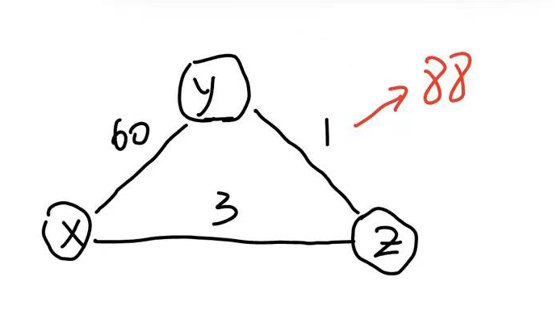
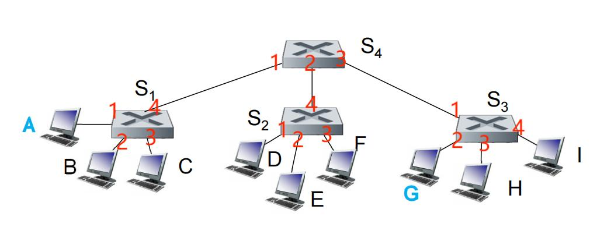
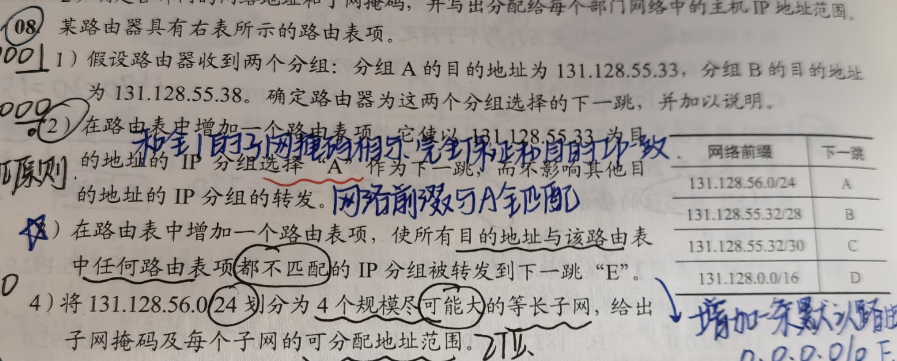
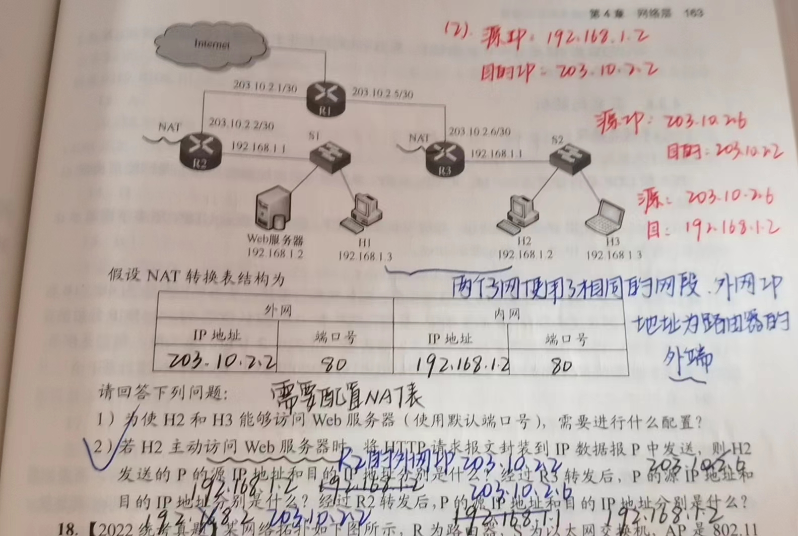
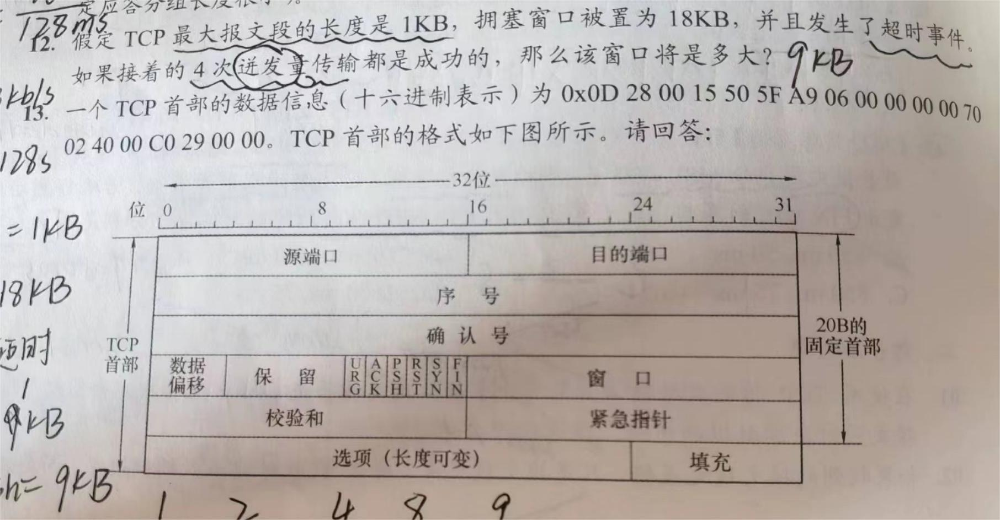
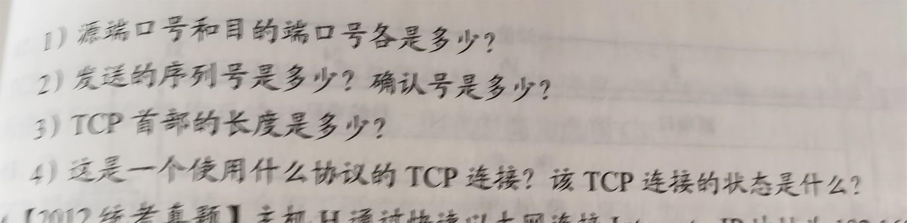
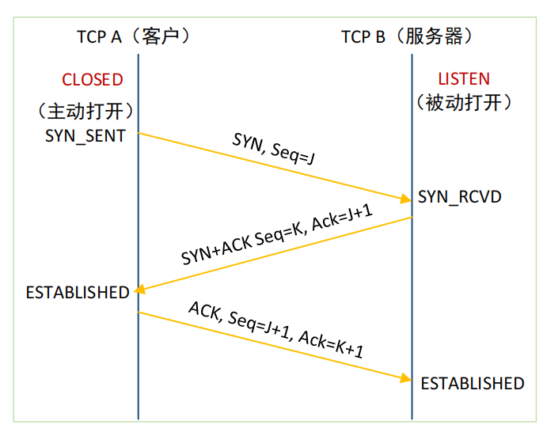
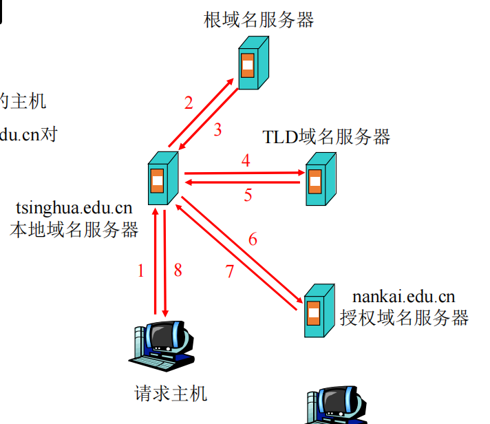
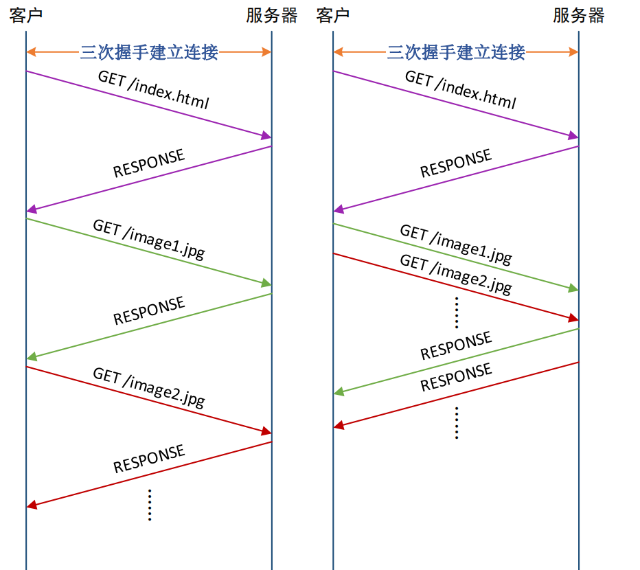

## 2023学年计算机网络回忆版试题

> 纯手打回忆，刚刚考完试记录的，可能漏题目条件和信息，表述的也不够清晰，记得数据的都尽可能给你了。
>
> 不过可以看看有哪些考点，今年很简单，虽然我错了很多简单题，非常难过。
>
> by 我永远喜欢月社妃

#### 一、小计算合集（细心、审题）

1、**（RENO拥塞控制）**TCP传输过程中，发生了超时，此时拥塞控制窗口大小为16KB，一个MSS为1KB大小，超时发生后，又过了4个RTT都没有丢失数据报，问：现在的窗口大小为多少？

2、**（CRC校验）**给出G为x^4+x^3+1，给出要传输的数据为11110011，计算CRC校验码

3、**（毒性逆转）**

​	如上图的路由转移代价图，在毒性逆转机制下，经过路由-向量算法响应稳定之后，y到z的路径代价变为了88，y首先发现了这个改变，并更新自己的邻居路由代价表（假设这期间没有收到别人的路由响应），画出更新后的邻居路由代价表

4、**（ip路由聚合）**

​	一个前缀16位的地址，需要划分为128个子网，问子网可以有几个ip地址可以分配？若将16个连续子网再进行聚合，新得到的这个地址块前缀为多少位？

#### 二、交换机（接口层）（别复习漏了）

​	如ppt这个图，一开始的时候全部交换机的交换表都为空，进行两次传输：1、E到I传输一个数据帧，2、I到E传输一个数据帧：

（1）描述从主机E发送数据帧到I主机的过程

（2）这两次传输完成后，S1和S4交换表的内容

#### 三、CIDR和最长前缀原则（网络层）

​	给出路由表，给出两个数据包的目的ip地址，计算这两个数据包需要转到哪里

​	是这道考研题的第一问，只是数据不一样：

#### 四、NAT转换（网络层）

​	2020年408考研原题，数据都没改，唉

#### 五、TCP报文分析、三次握手（传输层）

​	本题是个阴间题，第一问分析错了后面连着错。

（1）第一问类似于这个考研题，除了问的这个四个之外，还增加了几个问的地方（报文结构考试会给出）：

- SYN是否置位？
- 问该报文是由谁发出，服务器还是客户端？ （原题中可以从端口号、Flag判断）

（2）第二问就是根据上一问的分析（实际上这是个TCP的三次握手的一部分），根据报文的序号和确认号，画出正确的TCP三次握手的图，就是下图：

（3）若客户端缓冲区无限大、不考虑拥塞等情况，TCP连接建立后，第一个报文可发送数据最大为多少？

#### 六、Socket编程（应用层）

​	给了类似于lab1的实验代码，找错和填空，今年出的很简单。

​	几乎都是是PPT中那些函数使用和参数的问题，只有一个空比较细节，即版本号通过哪个函数获取，需要对实验1的代码有印象。

#### 七、DNS服务和HTTP（应用层）

​	就是对一个非常经典的递归迭代结合的DNS查询。

第一问：复述一下DNS消息按时间顺序怎么发送的，指出每次发送的源（发送方）和目的（接收方）。

第二问：画一下HTTP的持久连接非流水线，和流水线机制下的两种请求路线图，就是这个：

​	
